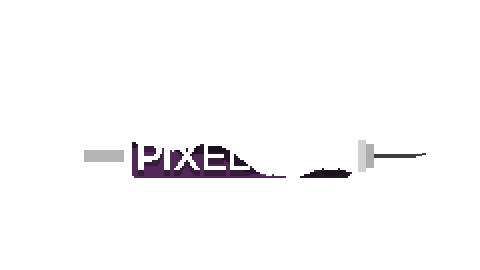

# PIXEL-VAC

<!--
TODO:
    GIF - LOGO
    ANNIE - FINAL
-->

Ajude Annie a encontrar a vacina enquanto toma as precauções adequadas para se proteger de um novo vírus!

PIXEL-VAC é um jogo criado para o Trabalho de Final de Curso do <a href="https://slt.ifsp.edu.br/">IFSP - Campus Salto</a>. O projeto foi desenvolvido utilizando a game engine <a href="https://www.yoyogames.com/en/get">Game Maker Studio 2</a>.

Assista a apresentação do grupo: https://www.youtube.com/watch?v=aH1ZUmARARY&ab_channel=GustavoHenrique
  

## Instalação

Para obter a versão executável do jogo, baixe o arquivo `pixelvac.zip`, extraia-o e, em seguida, execute a aplicação `Pixel-Vac.exe`.
  

## Dúvidas

Caso tenha curiosidade para saber como o jogo funciona, também é possível realizar o download do projeto `pixelvac.yyz` e abrí-lo por meio da plataforma Game Maker Studio 2.

E-mail para contato: andrealck1@gmail.com

 <strong>GLHF!</strong>

